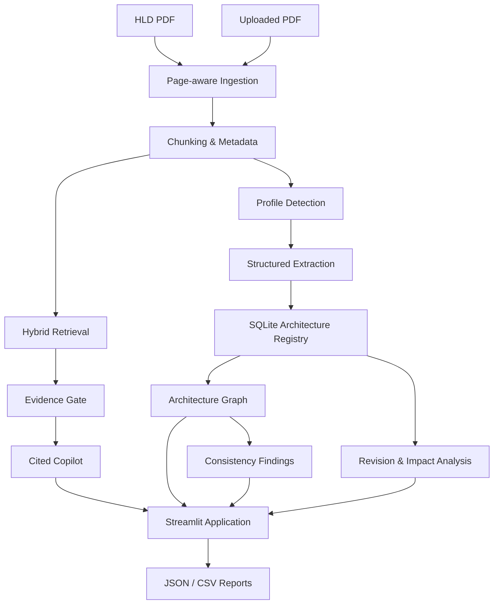

# ArchSense — AUTOSAR HLD Document Analysis Assistant

> **AI-assisted architecture intelligence for automotive High-Level Design documents.**

**Status: Completed — Tata Pulse / Tata Technologies Case Study 1 Pilot**

ArchSense is an engineering analysis tool that transforms unstructured AUTOSAR-style High-Level Design (HLD) documents into a traceable architecture knowledge base.

It provides:

- Page-aware document ingestion
- Hybrid lexical + semantic retrieval
- Citation-grounded question answering
- Structured architecture extraction
- Architecture graph exploration
- Deterministic consistency findings
- Revision comparison and impact analysis
- AUTOSAR Adaptive Platform support
- Exportable engineering reports
- Human-review-oriented workflows

The system is designed so that the LLM assists with language understanding while document metadata, provenance, citations, architecture relationships, and deterministic findings remain grounded in the source documents.

---

## Table of Contents

- [Overview](#overview)
- [Problem](#problem)
- [Solution](#solution)
- [Key Capabilities](#key-capabilities)
- [Architecture](#architecture)
- [Application](#application)
- [Technology Stack](#technology-stack)
- [Quickstart](#quickstart)
- [End-to-End Workflow](#end-to-end-workflow)
- [AI / RAG Design](#ai--rag-design)
- [AUTOSAR Adaptive Platform Support](#autosar-adaptive-platform-support)
- [Results and Evaluation](#results-and-evaluation)
- [Synthetic vs. Real Validation](#synthetic-vs-real-validation)
- [Testing](#testing)
- [Development and Evaluation Commands](#development-and-evaluation-commands)
- [Technical Milestones](#technical-milestones)
- [Repository Structure](#repository-structure)
- [Governance and Responsible AI](#governance-and-responsible-ai)
- [Limitations](#limitations)
- [License and Data Notice](#license-and-data-notice)

---

## Overview

AUTOSAR HLD documents contain architecture information across prose, tables, section structures, interfaces, ports, signals, dependencies, functional flows, and revision changes.

ArchSense converts this information into a searchable and traceable engineering workspace.

The system combines deterministic document processing with optional LLM assistance:

```text
                    ┌─────────────────────┐
                    │      HLD PDF        │
                    └──────────┬──────────┘
                               │
                               ▼
                    ┌─────────────────────┐
                    │ Page-aware Ingestion│
                    └──────────┬──────────┘
                               │
                    ┌──────────┴──────────┐
                    │                     │
                    ▼                     ▼
             Retrieval / RAG       Structured Extraction
                    │                     │
                    ▼                     ▼
             Evidence Gate         SQLite Registry
                    │                     │
                    ▼                     ▼
             Cited Copilot          Architecture Graph
                                          │
                              ┌───────────┴───────────┐
                              ▼                       ▼
                         Findings             Revision Analysis
                              │                       │
                              └───────────┬───────────┘
                                          ▼
                                  Streamlit Application
                                          │
                                          ▼
                                  JSON / CSV Reports
````

The project supports both a controlled synthetic HLD corpus for quantitative evaluation and a real AUTOSAR Adaptive Platform document for validation.

---

## Problem

AUTOSAR-style HLD documents describe system architecture through a combination of:

* Prose and technical narrative
* Catalogue and configuration tables
* Section structures
* Components and interfaces
* Ports and signals
* Dependencies
* Functional flows
* Multiple document revisions

The information required to answer a single engineering question can therefore be distributed across many pages.

Manual analysis makes it difficult to:

* Find relevant evidence quickly and identify its exact page
* Trace an answer or engineering claim back to the source
* Understand relationships between architecture elements
* Detect consistency and completeness issues
* Compare architecture revisions
* Determine which elements may be affected by a change

ArchSense addresses these problems by preserving document provenance throughout the analysis pipeline.

---

## Solution

ArchSense provides two complementary analysis paths.

### Retrieval and Q&A

```text
PDF
 │
 ▼
Page-aware ingestion
 │
 ▼
Section-aware chunking
 │
 ▼
BM25 + dense retrieval
 │
 ▼
Reciprocal Rank Fusion
 │
 ▼
Evidence gate
 │
 ▼
Grounded evidence
 │
 ▼
Cited Q&A
```

### Structured architecture analysis

```text
PDF
 │
 ▼
Page-aware ingestion
 │
 ▼
Structured extraction
 │
 ▼
SQLite architecture registry
 │
 ▼
Architecture graph
 │
 ├──► Consistency findings
 │
 └──► Revision / impact analysis
 │
 ▼
Exportable reports
```

Structured extraction and downstream architecture analysis are available for supported document profiles. Generic PDFs can still be ingested, indexed, and queried, but the system does not fabricate structured architecture entities or findings when a document profile is unsupported.

---

## Key Capabilities

### Document Intelligence

* Page-aware PDF ingestion
* Text, table, heading, and metadata extraction
* Section mapping
* Per-line provenance
* OCR fallback hook for scanned pages
* Safe document upload and content deduplication

### Retrieval and RAG

* BM25 lexical retrieval
* Dense embedding retrieval
* Reciprocal Rank Fusion (RRF)
* Section-aware chunking
* Evidence/refusal gate
* Citation-grounded Q&A
* Mechanically validated evidence IDs
* Mechanical quote extraction

### Structured Architecture Knowledge

* Deterministic architecture extraction
* Optional LLM-assisted extraction
* Typed architecture entities
* Relationships and facts
* Confidence values
* Source provenance
* SQLite registry
* Append-only audit trail

### Architecture Graph

* Version-scoped NetworkX graph
* Entity and relationship filtering
* Relationship provenance
* Entity search
* Graph paths and neighborhood exploration
* PyVis visualization
* JSON and GraphML export

### Architecture Analysis

* Undefined-reference detection
* Dangling-requirement detection
* Duplicate-interface detection
* Conflicting-provider detection
* Orphan-entity detection
* Unconsumed-signal detection
* Revision comparison
* Relationship change analysis
* Graph-based potential impact analysis

### AUTOSAR Support

* AUTOSAR Adaptive Platform profile
* Evidence-based document profile detection
* AUTOSAR-specific schema and extraction
* Real AUTOSAR document validation
* User PDF upload workflow

### Reporting

* Deterministic JSON reports
* Findings CSV
* Revision changes CSV
* Impact analysis CSV
* Architecture graph exports

---

## Architecture



The system is designed around a core principle:

> **The LLM assists with interpretation, but it is not the source of truth for document metadata, citations, architecture identity, or deterministic findings.**

---

## Application

ArchSense is implemented as a Streamlit engineering workspace.

The application contains eight screens:

| Screen                    | Purpose                                                                                                                           |
| ------------------------- | --------------------------------------------------------------------------------------------------------------------------------- |
| **Dashboard**             | Document/version statistics including pages, chunks, entities, facts, and findings, with navigation to the application workspace. |
| **Document Workspace**    | Page preview, section map, indexed chunk text, document metadata, and page-level provenance.                                      |
| **Architecture Explorer** | Interactive architecture graph with entity, predicate, confidence, and relationship exploration.                                  |
| **Copilot**               | Grounded Q&A with evidence citations and selectable LLM providers.                                                                |
| **Findings**              | Architecture findings, severity/type/status summaries, provenance, and analysis results.                                          |
| **Revision Compare**      | Comparison of two compatible document versions with change and potential-impact analysis.                                         |
| **Export & Report**       | Deterministic JSON report and findings/changes/impacts CSV downloads.                                                             |
| **Upload Documents**      | User PDF upload, ingestion, indexing, profile detection, and supported-profile structured analysis.                               |

The application maintains shared workspace state across the major analysis screens so that the selected document and version remain consistent throughout the workflow.

---

## Technology Stack

| Layer                        | Technology                                     |
| ---------------------------- | ---------------------------------------------- |
| Language                     | Python 3.11                                    |
| User Interface               | Streamlit                                      |
| PDF Processing               | PyMuPDF, pdfplumber                            |
| Synthetic Dataset Generation | ReportLab                                      |
| Vector Store                 | ChromaDB                                       |
| Embeddings                   | sentence-transformers                          |
| Lexical Retrieval            | BM25                                           |
| Retrieval Fusion             | Reciprocal Rank Fusion                         |
| LLM Providers                | OpenRouter, Ollama, deterministic offline mock |
| Graph                        | NetworkX, PyVis                                |
| Structured Storage           | SQLite, SQLAlchemy                             |
| Data Validation              | Pydantic                                       |
| Visualization / Tables       | Plotly, pandas through Streamlit               |
| Testing                      | pytest, Streamlit AppTest                      |

The default workflow can run locally without an external LLM provider. OpenRouter or Ollama can be selected when LLM-assisted functionality is required.

---

## Quickstart

### 1. Create a virtual environment

```bash
python -m venv .venv
```

### 2. Install dependencies

#### Windows

```bash
.venv/Scripts/python -m pip install -r requirements.txt
```

#### macOS / Linux

```bash
.venv/bin/python -m pip install -r requirements.txt
```

### 3. Launch the application

#### Windows

```bash
.venv/Scripts/python -m streamlit run app/main.py
```

#### macOS / Linux

```bash
.venv/bin/python -m streamlit run app/main.py
```

The application is available at:

```text
http://localhost:8501
```

The repository contains the synthetic demonstration corpus, ground truth, and real AUTOSAR validation document used by the project.

Generated runtime artifacts such as processed documents, vector indexes, databases, evaluation outputs, graphs, and exports are stored under `data/` paths and are excluded from version control.

---

## End-to-End Workflow

### 1. Document ingestion

The ingestion pipeline extracts:

* Text
* Tables
* Headings
* Section structure
* Metadata
* Page-level provenance

Processed documents retain the relationship between extracted information and its source document page.

An OCR fallback hook is available for scanned pages.

### 2. Retrieval

Documents are divided into deterministic, section-aware chunks.

Prose is grouped into context-preserving chunks, while tables are represented as standalone linearized chunks with provenance.

Chunks are indexed using:

* Dense embeddings
* BM25 lexical retrieval

The two retrieval strategies are combined through Reciprocal Rank Fusion.

### 3. Evidence gate

Before an LLM is called, a deterministic evidence gate checks whether the question has sufficient support in the indexed corpus.

The gate considers:

* Lexical evidence
* Query terminology coverage
* Retrieval agreement

Questions without sufficient evidence receive:

```text
INSUFFICIENT EVIDENCE
```

instead of being sent to the model for unsupported generation.

### 4. Copilot

Grounded evidence blocks are passed to the selected LLM provider together with response rules.

The model returns structured information containing:

* Answer
* Evidence IDs
* Insufficient-evidence status

Evidence IDs are resolved against trusted document metadata.

Unknown or fabricated evidence IDs fail validation.

Quotes are extracted mechanically from the source chunks rather than generated by the LLM.

### 5. Structured extraction

Supported document profiles can be converted into structured architecture knowledge.

The extraction pipeline combines:

* Deterministic table handlers
* Prose patterns
* Optional LLM-assisted extraction

Extracted entities and facts undergo mechanical validation before being persisted.

Validation includes:

* Evidence resolution
* Reference existence
* Domain/range checks
* Confidence thresholds
* Deterministic deduplication

### 6. Architecture registry

Validated architecture information is stored in SQLite.

The registry contains typed entities, facts, relationships, confidence values, provenance, analysis runs, and audit information.

Architecture facts remain traceable through:

```text
Fact
 ↓
Chunk
 ↓
Document
 ↓
Version
 ↓
Section
 ↓
Page
```

### 7. Architecture graph

The graph is derived from the structured registry rather than independently authored.

Nodes represent architecture entities.

Edges represent validated architecture facts.

Graphs are version-scoped and preserve relationship provenance.

### 8. Findings

Architecture findings are generated by deterministic rule-based detectors.

Examples include:

* Undefined references
* Dangling requirements
* Duplicate interfaces
* Conflicting providers
* Orphan entities
* Unconsumed signals

Findings include deterministic identifiers and trusted provenance.

### 9. Revision comparison

Two compatible document versions can be compared using:

* Canonical entity keys
* Fact/relationship identity
* Graph traversal

The system reports:

* Added entities
* Removed entities
* Changed entities
* Added relationships
* Removed relationships
* Potentially impacted elements

Impact analysis is explicitly reported as potential impact rather than guaranteed impact.

### 10. User uploads

Uploaded PDFs are:

1. Stored safely
2. Deduplicated using SHA-256
3. Processed through page-aware ingestion
4. Indexed into an isolated vector collection
5. Classified using evidence-based profile detection
6. Routed to structured extraction when the profile is supported

The main and external-test vector indexes are kept separate from user-uploaded content.

---

## AI / RAG Design

A central design principle of ArchSense is that the LLM should operate **inside a trusted evidence boundary**.

```text
BM25 + Dense Retrieval
          │
          ▼
   RRF Fusion (k=60)
          │
          ▼
   Evidence Gate
   ──────────────
   Mechanical
   Pre-LLM check
          │
          ▼
 Grounded Evidence
 [E1 ... En]
          │
          ▼
       LLM
          │
          ▼
Structured JSON
{answer, evidence_ids,
 insufficient_evidence}
          │
          ▼
Citation Validation
```

### Evidence grounding

The LLM does not generate:

* Document IDs
* Version IDs
* Section numbers
* Page numbers
* Chunk IDs

These values come from trusted indexed document metadata.

### Citation validation

Every evidence reference generated by the model is resolved against the trusted evidence map.

Unknown evidence IDs are rejected.

### Quote extraction

Quoted text is extracted from the cited document chunks rather than generated by the model.

### Insufficient evidence

If the retrieval evidence does not support a question, the system can refuse before the LLM is called.

The model also has a structured insufficient-evidence state that provides a second layer of protection.

---

## AUTOSAR Adaptive Platform Support

The completed M9 scope extends the original synthetic HLD workflow to real AUTOSAR Adaptive Platform documentation.

### Supported profiles

| Profile                     | Scope                                                  |
| --------------------------- | ------------------------------------------------------ |
| `application_hld`           | Synthetic ABC HLD schema with full structured analysis |
| `autosar_adaptive_platform` | Dedicated AUTOSAR Adaptive Platform schema             |
| `generic`                   | Ingestion, retrieval, and grounded Q&A only            |

Profile detection uses document evidence including:

* Title
* Section structure
* Domain terminology

A single keyword is not sufficient to classify a document.

### AUTOSAR schema

The AUTOSAR-specific schema covers concepts derived from verified document content, including:

* Adaptive applications
* ARA
* Functional clusters
* Platform foundation/services
* Interfaces
* Manifests

Relationships include:

```text
runs_on
provides_interface
uses_interface
belongs_to
configured_by
```

Extracted facts retain document and page provenance.

### Real-document validation

Validation was performed against:

**AUTOSAR Explanation of Adaptive Platform Design, R20-11, Document ID 706**

| Check                                      |      Result |
| ------------------------------------------ | ----------: |
| Entities extracted                         |      **34** |
| Facts extracted                            |      **77** |
| Facts with trusted page/section provenance | **77 / 77** |
| Validation errors                          |       **0** |

Hand-verified spot checks include section 3.1.1 (ARA), pages 15–16.

There is no gold-standard annotation set for this real AUTOSAR document. Therefore, precision, recall, and F1 are **not claimed** for the real-document validation.

Instead, the validation reports extraction counts, provenance coverage, validation outcomes, and hand-verified checks.

---

## Results and Evaluation

Quantitative evaluation was performed against the project's controlled synthetic HLD corpus and machine-readable ground truth.

### Retrieval

| Method | Page Hit@5 | Section Hit@5 |     MRR@5 |
| ------ | ---------: | ------------: | --------: |
| Hybrid |  **0.867** |     **0.833** | **0.709** |
| Dense  |      0.800 |         0.700 |     0.658 |

The hybrid retriever outperformed dense-only retrieval across the reported retrieval metrics.

The lexical retriever retained the strongest section Hit@1 result and the lowest measured latency in the comparison.

### Embedding benchmark

| Embedding / Baseline | Page Hit@5 |   Throughput |
| -------------------- | ---------: | -----------: |
| all-MiniLM-L6-v2     |      0.800 |  159 texts/s |
| bge-m3               |      0.867 |    3 texts/s |
| Hashing baseline     |      0.900 | 3758 texts/s |

These measurements are corpus- and hardware-specific and should not be interpreted as general embedding benchmarks.

### Structured extraction

| Evaluation | Precision | Recall |    F1 |
| ---------- | --------: | -----: | ----: |
| Entities   |     1.000 |  1.000 | 1.000 |
| Facts      |     1.000 |  1.000 | 1.000 |

Provenance accuracy:

**1.000**

The evaluation covered both synthetic HLD revisions:

* 165 and 149 gold entities
* 200 and 178 gold facts

The deterministic extraction pipeline completed at approximately 17 ms per version on the evaluation corpus.

### Architecture graph

| Evaluation        | Precision | Recall |    F1 |
| ----------------- | --------: | -----: | ----: |
| Graph nodes/edges |     1.000 |  1.000 | 1.000 |

Graph provenance correctness:

**1.000**

Registry-to-graph validation reported:

* 0 missing relationships
* 0 extra relationships
* 0 duplicate fact keys

Graph construction took approximately 15–50 ms per version on the evaluation corpus.

### Findings

The clean v1.0.0 synthetic baseline produced:

```text
0 findings
```

The v1.1.0 revision contained a planted orphan entity, which was detected.

Applicable gold-standard evaluation:

```text
Precision = 1.000
Recall    = 1.000
F1        = 1.000
```

Other planted defects that required information outside the applicable detector scope were reported as not applicable rather than silently counted as failures or fabricated detections.

### Revision comparison

On the synthetic revision pair:

```text
Added entities:        0
Removed entities:     16
Renamed/changed:       1

Added relationships:   43
Removed relationships: 65

Potential impacts at depth 1: 974
```

Applicable gold-standard evaluation:

```text
Precision = 1.000
Recall    = 1.000
F1        = 1.000
```

### Important evaluation note

The perfect precision/recall/F1 values above are measured against a controlled synthetic corpus with exact ground truth.

They are **not general real-world performance guarantees**.

---

## Synthetic vs. Real Validation

ArchSense deliberately separates controlled evaluation from real-document validation.

### Synthetic corpus

Located under:

```text
data/sample_docs/
data/ground_truth/
```

The synthetic corpus contains two HLD revisions:

* `v1.0.0` — clean baseline
* `v1.1.0` — revision containing planted architecture defects

Because the entities, facts, relationships, retrieval questions, and planted defects are known exactly, the project can calculate quantitative precision, recall, and F1 scores.

The synthetic corpus does not represent a real vehicle program or proprietary automotive architecture.

### Real AUTOSAR validation

Located under:

```text
data/external_test/
```

The real AUTOSAR Adaptive Platform document is used to validate:

* PDF ingestion
* Retrieval
* Structured extraction
* Provenance
* Architecture graph construction
* Conservative findings

No gold-standard annotation set was available for this document.

Therefore, the project reports:

* Entity counts
* Fact counts
* Provenance coverage
* Validation errors
* Hand-verified spot checks

rather than unsupported precision/recall values.

---

## Testing

The completed project has:

**481 automated tests passing**

The default test suite can be executed with:

```bash
.venv/Scripts/python -m pytest tests/
```

One optional LLM-model test is deselected by default.

### Application screen validation

The repository also includes a Streamlit AppTest-based screen verification suite:

```bash
.venv/Scripts/python scripts/verify_app_screens.py
```

The battery exercises the application screens and validates real UI controls, state transitions, graph rendering, grounded answers, findings, revision comparison, exports, and workspace state.

The current screen-verification battery is not fully green: some assertions reflect the latest UI changes and the Revision Compare screen currently has a rendering issue. The main pytest suite remains fully green with 481 passing tests.

No code-coverage percentage is claimed because coverage is not measured.

---

## Development and Evaluation Commands

The application can be launched using the Quickstart above. The following commands are available for rebuilding and evaluating individual project stages.

### M0 / M1 — Dataset and ingestion

```bash
.venv/Scripts/python scripts/generate_dataset.py
.venv/Scripts/python scripts/process_sample_docs.py
```

### M2 — Retrieval and vector indexing

```bash
.venv/Scripts/python scripts/build_vector_index.py
.venv/Scripts/python scripts/build_vector_index.py --model hashing

.venv/Scripts/python scripts/evaluate_retrieval.py
.venv/Scripts/python scripts/compare_retrieval_modes.py
.venv/Scripts/python scripts/calibrate_gate.py

.venv/Scripts/python scripts/retrieve_demo.py "door signals" --top-k 5 --version 1.0.0
```

### M3 — Copilot

```bash
.venv/Scripts/python scripts/ask_copilot.py "Which component provides the VehicleSpeed signal?"

.venv/Scripts/python scripts/ask_copilot.py "What is the brake pressure of the front axle?"

.venv/Scripts/python scripts/ask_copilot.py "..." --json

.venv/Scripts/python scripts/ask_copilot.py "..." --provider openrouter
```

OpenRouter requires an `OPENROUTER_API_KEY` configured locally.

### M4 — Structured extraction

```bash
.venv/Scripts/python scripts/extract_entities.py
.venv/Scripts/python scripts/extract_entities.py --llm
.venv/Scripts/python scripts/extract_entities.py --reset
.venv/Scripts/python scripts/extract_entities.py --json

.venv/Scripts/python scripts/query_entities.py --entities
.venv/Scripts/python scripts/query_entities.py --entity C-02
.venv/Scripts/python scripts/query_entities.py --related C-10

.venv/Scripts/python scripts/evaluate_extraction.py
```

### M5 — Architecture graph

```bash
.venv/Scripts/python scripts/graph_explorer.py --version 1.0.0 --stats
.venv/Scripts/python scripts/graph_explorer.py --version 1.0.0 --related C-02
.venv/Scripts/python scripts/graph_explorer.py --version 1.0.0 --path C-02 IF-01
.venv/Scripts/python scripts/graph_explorer.py --version 1.0.0 --predicate requires
.venv/Scripts/python scripts/graph_explorer.py --version 1.0.0 --type component
.venv/Scripts/python scripts/graph_explorer.py --version 1.0.0 --confidence 0.95
.venv/Scripts/python scripts/graph_explorer.py --version 1.0.0 --node C-02 --depth 1

.venv/Scripts/python scripts/graph_explorer.py --version 1.0.0 --render
.venv/Scripts/python scripts/graph_explorer.py --version 1.0.0 --json
.venv/Scripts/python scripts/graph_explorer.py --version 1.0.0 --export-graphml

.venv/Scripts/python scripts/evaluate_graph.py
```

### M6 — Findings

```bash
.venv/Scripts/python scripts/analyze_findings.py --version 1.0.0
.venv/Scripts/python scripts/analyze_findings.py --version 1.1.0 --persist
.venv/Scripts/python scripts/analyze_findings.py --version 1.1.0 --json
.venv/Scripts/python scripts/analyze_findings.py --version 1.1.0 --finding-type orphan_entity

.venv/Scripts/python scripts/evaluate_findings.py
.venv/Scripts/python scripts/evaluate_findings.py --json
```

### M7 — Revision comparison

```bash
.venv/Scripts/python scripts/compare_revisions.py \
    --base-version 1.0.0 --target-version 1.1.0

.venv/Scripts/python scripts/compare_revisions.py \
    --base-version 1.0.0 --target-version 1.1.0 --depth 2 --json

.venv/Scripts/python scripts/compare_revisions.py \
    --base-version 1.0.0 --target-version 1.1.0 --persist

.venv/Scripts/python scripts/evaluate_revisions.py --save
```

### M8 — Streamlit application

```bash
.venv/Scripts/python -m streamlit run app/main.py
.venv/Scripts/python scripts/verify_app_screens.py
```

### M9 — AUTOSAR upload pipeline

```bash
.venv/Scripts/python scripts/ingest_upload.py \
    data/external_test/AUTOSAR_EXP_PlatformDesign.pdf
```

### Full test suite

```bash
.venv/Scripts/python -m pytest tests/
```

---

## Technical Milestones

### M0 / M1 — Synthetic Dataset and Page-aware Ingestion

The project generates two controlled HLD revisions from a source-of-truth architecture model:

* v1.0.0 — clean
* v1.1.0 — contains planted architecture defects

Machine-readable ground truth is generated for entities, facts, retrieval questions, and defects.

The ingestion pipeline extracts:

* Per-page text
* Tables
* Headings
* Section maps
* Document metadata
* Line-level provenance

It also includes an OCR fallback hook for scanned pages.

---

### M2 / M3 — Retrieval and Cited RAG Copilot

The retrieval pipeline uses deterministic section-aware chunking.

Prose is grouped into approximately 500-token packs with overlap, while tables are represented as standalone linearized chunks.

Each chunk retains provenance including:

* Document
* Version
* SHA-256
* Section
* Pages
* Sequence
* Content type

The default dense embedding model is `all-MiniLM-L6-v2`.

A hashing embedding mode is available for zero-download testing.

Retrieval supports:

* Hybrid
* Dense
* Lexical

Hybrid retrieval uses Reciprocal Rank Fusion with:

```text
rrf_k = 60
```

The evidence gate checks whether a question is sufficiently supported before invoking an LLM.

The copilot supports:

* Deterministic mock provider
* OpenRouter
* Ollama

Citation validation ensures that model-generated evidence references resolve to trusted chunks.

---

### M4 — Structured Extraction and SQLite Registry

Structured extraction uses deterministic table handlers and prose patterns.

The pipeline supports entities and relationships such as:

* Components
* Interfaces
* Ports
* Signals
* Dependencies
* Functional flows

An optional LLM extraction path can operate under the same evidence contract.

Before persistence, extracted facts are checked for:

* Evidence validity
* Reference existence
* Domain/range validity
* Confidence threshold
* Duplicate facts

The resulting structured architecture is persisted in SQLite with provenance and audit information.

Measured on the synthetic evaluation corpus:

```text
Entities:
P = 1.000
R = 1.000
F1 = 1.000

Facts:
P = 1.000
R = 1.000
F1 = 1.000

Provenance accuracy = 1.000
```

---

### M5 — Architecture Graph Explorer

The architecture graph is derived directly from the structured registry.

```text
SQLite Registry
      │
      ▼
Graph Builder
      │
      ▼
NetworkX MultiDiGraph
      │
      ├── Filtering
      ├── Analysis
      ├── Path exploration
      ├── JSON export
      ├── GraphML export
      └── PyVis visualization
```

Graph nodes represent architecture entities.

Graph edges represent architecture facts.

Each relationship retains trusted provenance.

Graphs are strictly version-scoped.

On the synthetic corpus:

```text
Nodes/edges:
P = 1.000
R = 1.000
F1 = 1.000

Provenance correctness = 1.000
```

---

### M6 — Deterministic Architecture Findings

The findings engine uses deterministic rule families over the architecture registry and graph.

Supported finding categories include:

* Undefined references
* Dangling requirements
* Duplicate interfaces
* Conflicting providers
* Orphan entities
* Unconsumed signals

Each finding contains:

* Deterministic ID
* Finding type
* Provenance
* Rule-based confidence
* Human-review status

On the synthetic v1.1.0 revision, the planted orphan entity was detected with:

```text
Precision = 1.000
Recall    = 1.000
F1        = 1.000
```

---

### M7 — Revision Comparison and Impact Analysis

Revision comparison uses canonical entity keys and fact identity to determine architecture changes.

The system identifies:

* Added entities
* Removed entities
* Renamed/changed entities
* Added relationships
* Removed relationships

Potential impact is determined through graph traversal with configurable depth.

Every impact path is verified against the architecture graph.

On the synthetic revision pair:

```text
Added entities:        0
Removed entities:     16
Renamed/changed:       1

Added relationships:   43
Removed relationships: 65

Potential impacts at depth 1: 974
```

Applicable gold-standard evaluation:

```text
Precision = 1.000
Recall    = 1.000
F1        = 1.000
```

---

### M8 — Streamlit Application

The Streamlit interface integrates the M1–M7 services into a unified engineering workspace.

The application provides:

* Shared document/version state
* Document workspace
* Architecture graph exploration
* Grounded Copilot
* Findings
* Revision comparison
* Report export

The UI uses service adapters so that application screens consume the underlying analysis services rather than reimplementing the architecture logic.

---

### M9 — AUTOSAR Adaptive Platform Profile and Uploads

M9 adds real AUTOSAR Adaptive Platform document support and user PDF uploads.

The upload pipeline performs:

```text
Upload
  ↓
Safe storage
  ↓
SHA-256 content deduplication
  ↓
Page-aware ingestion
  ↓
Isolated vector indexing
  ↓
Evidence-based profile detection
  ↓
Structured extraction when supported
```

Supported profiles include:

```text
application_hld
autosar_adaptive_platform
generic
```

Generic documents receive ingestion, retrieval, and Q&A capabilities only.

The system does not fabricate structured architecture analysis for unsupported document types.

---

## Repository Structure

```text
ArchSense/
│
├── backend/
│   ├── dataset/          # Synthetic HLD generation and ground truth
│   ├── ingestion/        # PDF parsing and page-aware ingestion
│   ├── rag/              # Chunking, embeddings, retrieval and RAG
│   ├── extraction/       # Structured architecture extraction
│   │   └── autosar/      # AUTOSAR Adaptive Platform support
│   ├── graph/            # Architecture graph construction and analysis
│   ├── findings/         # Deterministic architecture findings
│   ├── diff/             # Revision comparison and impact analysis
│   ├── uploads/          # User upload pipeline
│   └── storage/          # SQLite schema, sessions and audit log
│
├── app/
│   ├── components/       # Shared UI components
│   ├── services/         # UI-facing service adapters
│   └── screens/          # Streamlit application screens
│
├── scripts/
│   ├── Dataset generation
│   ├── Ingestion
│   ├── Retrieval evaluation
│   ├── Copilot CLI
│   ├── Structured extraction
│   ├── Graph exploration
│   ├── Findings analysis
│   ├── Revision comparison
│   ├── Screen verification
│   └── AUTOSAR upload ingestion
│
├── tests/                # Automated test suite
│
├── docs/
│   ├── PROJECT_DECISIONS.md
│   └── IMPLEMENTATION_STATUS.md
│
├── data/
│   ├── sample_docs/      # Synthetic HLD documents
│   ├── ground_truth/     # Synthetic evaluation ground truth
│   └── external_test/    # Real AUTOSAR validation document
│
├── requirements.txt
└── README.md
```

Generated runtime artifacts such as processed documents, vector stores, evaluation results, databases, graphs, exports, and uploads are stored under git-ignored `data/` directories.

---

## Governance and Responsible AI

ArchSense is designed around evidence traceability and human review.

### Grounded answers

Copilot responses are grounded in approved source documents and include evidence references.

### Explicit refusal

Questions without sufficient corpus evidence can be rejected before LLM generation rather than answered through unsupported guessing.

### Citation validation

Document/version/section/page metadata comes from stored document chunks.

The LLM supplies evidence IDs rather than authoritative document metadata.

### Human review

Architecture findings are presented as potential issues for engineering review.

They are not treated as automatic engineering decisions or safety certification.

### Auditability

The architecture registry maintains audit information for consequential analysis operations.

### Local-first architecture

Structured data is stored locally in SQLite and vectors are stored in a local ChromaDB directory.

LLM access is abstracted behind a provider interface supporting:

* Deterministic mock
* OpenRouter
* Ollama

### Unsupported documents

Generic documents are clearly identified as unsupported for structured architecture analysis instead of generating fabricated architecture entities or findings.

---

## Limitations

* The synthetic evaluation corpus is controlled and does not represent a production vehicle program.
* Perfect synthetic precision/recall/F1 values reflect exact ground truth and should not be interpreted as general real-world performance.
* The real AUTOSAR document does not have a gold-standard annotation set, so precision/recall/F1 are not claimed for that validation.
* LLM-assisted Copilot answers and optional extraction remain subject to human review.
* Generic PDFs support ingestion, retrieval, and Q&A, but structured architecture analysis is available only for supported profiles.
* Architecture findings are conservative deterministic checks and are not safety certification.
* Impact analysis identifies potentially impacted elements through graph relationships; it does not guarantee that an engineering change will affect those elements.
* Revision comparison requires two compatible versions of the same document/profile.
* The Streamlit AppTest screen-verification battery currently contains some stale UI assertions and a Revision Compare rendering issue. The main automated pytest suite remains fully green with 481 passing tests.

---

## License and Data Notice

The HLD corpus under:

```text
data/sample_docs/
```

is **synthetic** and does not represent a real vehicle program or proprietary architecture.

The real AUTOSAR document under:

```text
data/external_test/
```

is used solely for local validation of the AUTOSAR Adaptive Platform workflow.

No software license file is currently included with this pilot repository.

---

## Author

**Aarya Yadav**

B.Tech — Computer Engineering, AI & Data Science
MIT World Peace University, Pune

Built as part of the **Tata Pulse / Tata Technologies Case Study 1 pilot**.